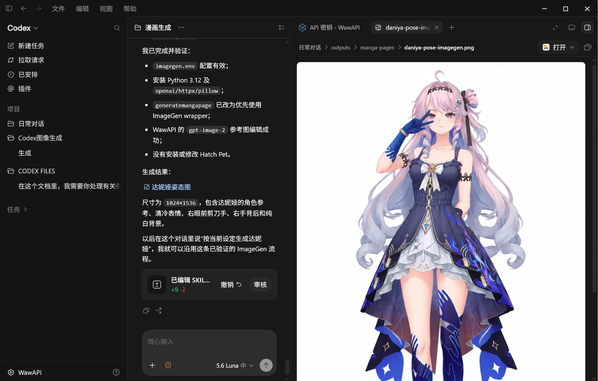

在第三方 API 中转的语言智能体根据用户意图调用第三方图片生成 API，实现在聊天框中生成图片。 / A language agent using a third-party API relay calls a third-party image-generation API based on user intent to generate images in the chat box.

在第三方api中转的语言智能体根据用户意图调用第三方图片生成 API，实现在聊天框中生成图片。



A minimal example showing how to call a third-party image-generation API from a chat workflow.

## 项目内容 | Contents

- 后端代理图片请求，避免把 API Key 暴露给浏览器
- 根据消息内容判断是否进入图片生成分支
- 支持 OpenAI-compatible 图片接口
- 支持返回图片 URL、Base64 或 Data URL
- 记录 Codex Desktop / Windows 配置流程

## 参考项目 | Reference project

本项目的 Codex 图片生成安装思路参考：

<https://github.com/Xiazhixuan119748/hatch-pet-and-imagegen->

本教程只采用该项目中的 **ImageGen** 部分，不安装或启用 `Hatch Pet`。核心做法是：备份 Codex 官方 ImageGen，将参考项目提供的 ImageGen 文件安装到本机 Skill 目录，再通过本机 `imagegen.env` 配置第三方图片 Provider。

详细步骤见 [`docs/reference-imagegen.md`](docs/reference-imagegen.md)。

## 架构 | Architecture

```text
Chat UI
  -> Your backend
       |- text-model branch
       `- image-generation branch -> third-party image API
```

文字模型和图片模型可以是不同供应商，不需要替换聊天模型。

## 快速开始 | Quick start

### 1. 安装依赖

```powershell
npm install
```

### 2. 创建本地配置

```powershell
Copy-Item .env.example .env
```

编辑 `.env`，只在本地填写真实 Key：

```dotenv
PORT=3000
IMAGE_GENERATION_URL=https://your-provider.example/v1/images/generations
IMAGE_API_KEY=replace_me
IMAGE_MODEL=gpt-image-2
```

示例供应商若提供 OpenAI-compatible 接口，可将 `IMAGE_GENERATION_URL` 替换成其文档中的图片生成地址。不要把真实 Key 提交到 GitHub。

### 3. 启动服务

```powershell
npm run dev
```

打开 `http://localhost:3000`，或直接测试：

```powershell
curl.exe -X POST http://localhost:3000/api/chat `
  -H "Content-Type: application/json" `
  -d '{"message":"生成一张雨夜车站的黑白漫画"}'
```

## Codex Desktop 配置方法

本项目记录的流程是：保持聊天使用当前文字模型，单独配置图片 Provider。

1. 准备 Python 3.10+ 和一个支持图片生成的 API Key。
2. 将配置写入本机的 `~/.codex/imagegen.env`，Windows 通常是：
   `C:\Users\你的用户名\.codex\imagegen.env`
3. 使用 OpenAI-compatible 配置时，示例格式如下：

```dotenv
IMAGE_PROVIDER=openai
OPENAI_API_KEY=replace_me
OPENAI_BASE_URL=https://your-provider.example/v1
OPENAI_IMAGE_MODEL=gpt-image-2
```

4. 用 dry-run 检查配置，不会生成图片：

```powershell
$Imagegen = Join-Path $env:USERPROFILE '.codex\skills\.system\imagegen\scripts\image_gen_with_codex_env.py'
py $Imagegen generate `
  --prompt 'configuration test' `
  --dry-run `
  --out "$env:TEMP\imagegen-dry-run.png"
```

5. 生成图片：

```powershell
py $Imagegen generate `
  --prompt 'A finished black-and-white Japanese manga illustration of a rainy train station at night, cinematic composition, wet reflections, ink fills and screentone shading, no watermark.' `
  --size '1024x1024' `
  --quality 'high' `
  --out "$env:USERPROFILE\Desktop\rainy-station-girl.png"
```

更换供应商时，通常只需要修改本机 `imagegen.env` 中的 Key、Base URL 和模型名，不需要修改聊天模型配置。

### 本项目与参考项目的关系

参考项目负责提供 ImageGen Skill 的安装和 Provider 配置思路；本项目额外补充了聊天分流、后端 API Key 隔离、第三方接口适配和错误处理示例。两者可以独立使用：

- 只想在 Codex 中生成图片：按参考项目的 ImageGen 部分操作。
- 想把图片生成接入自己的聊天网页：运行本项目的 `server/index.mjs`。

## 常见问题 | Troubleshooting

- `401`：Key 无效、过期或没有图片权限。
- `404`：检查 Base URL 和完整图片接口路径。
- `429`：触发限流，降低并发并稍后重试。
- `502`：上游网关或供应商暂时不可用，先检查供应商状态。
- 模型不存在：确认模型名称和供应商文档完全一致。

失败请求不要无间隔重复提交，因为某些供应商可能已经产生计费。

## 安全说明 | Security

- 不要把 API Key 写进代码、README、截图、Issue 或 Git 历史。
- `.env` 已加入 `.gitignore`。
- 如果 Key 曾经公开，立即撤销并重新生成。
- 生产环境建议增加鉴权、限流、日志脱敏和请求额度控制。

## License

MIT

